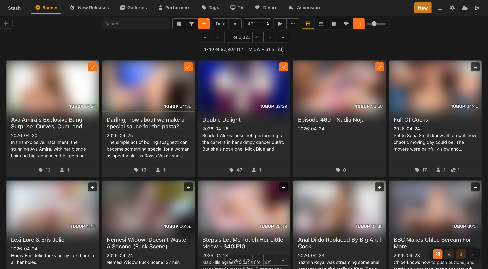
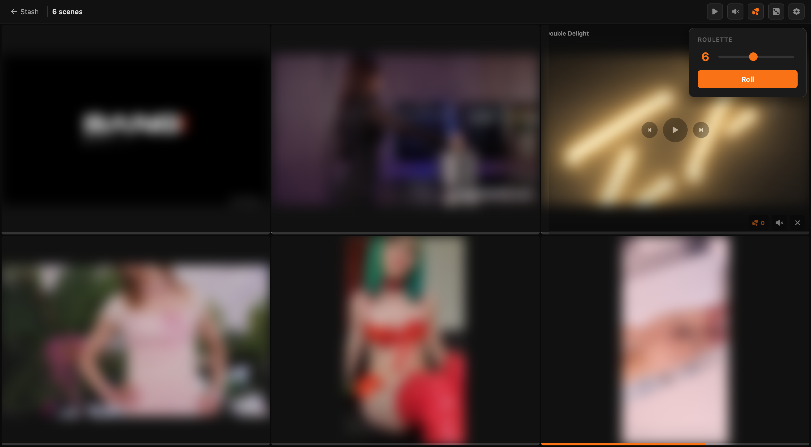

# Multi-View Player

A Stash plugin that lets you queue scenes and live search filters from any browse page and watch up to 12 simultaneously in a minimal grid player. Filter slots automatically cycle through matching scenes when each one ends.

## Requirements

- [Stash](https://stashapp.cc) v0.27+

## Installation

### Option 1 — Automatic (recommended)

1. In Stash go to **Settings → Plugins → Add Source** and enter:
   ```
   https://ordureconnoisseur.github.io/plugins/main/index.yml
   ```
2. Find **Multi-View Player** in the plugin browser and click **Install**

### Option 2 — Manual

1. Download this repository (Code → Download ZIP) and extract it
2. Place the `multiView` folder inside a category subfolder of your Stash plugins directory:
   - **Linux/Mac:** `~/.stash/plugins/Utilities/multiView/`
   - **Windows:** `%USERPROFILE%\.stash\plugins\Utilities\multiView\`

   > The plugin must be **two levels deep** inside the plugins directory — `plugins/Category/Plugin/`. Placing it directly under `plugins/` will cause it not to appear in Stash.

3. In Stash, go to **Settings → Plugins** and click **Reload Plugins**
4. Enable **Multi-View Player**

## Usage

### Picking Mode

On any scene browse page, click the grid icon button in the toolbar (next to the view mode buttons, before the zoom slider) to enable **Picking Mode**. While active:

- Each scene card shows a **+** button — click to queue that scene (turns orange with a ✓ when queued)
- A **+** button appears next to Stash's filter icon — click to add the **current search** as a filter slot

A floating launcher in the bottom-right shows your queue and opens the player. It displays scene count and filter slot count as separate badges.

You can queue up to **12 items** (scenes and filter slots combined).



### Filter Slots

A filter slot captures your current search query rather than a specific scene. When the player opens, each filter slot picks a random scene matching that search. When the scene ends, the slot automatically fetches and plays another — giving you an endless rotating stream from that search running alongside your pinned scenes. Filter slot cells are labelled **Filter:** in the player.

To add a filter slot: enable Picking Mode, apply your search in Stash, then click the **+** next to the filter icon in the toolbar. The button is only visible while Picking Mode is active.

### Roulette Mode

In the player, click the **dice button** in the top bar (left of Settings) to open the roulette menu. Use the slider to choose how many random scenes to load (1–12), then click **Roll**. Your last count is remembered.

Roulette cells behave like filter slots: each cell shows a **Random:** label and automatically advances to a fresh random scene when the current one ends — no repeats.

### Scene Detail Page

On an individual scene's page, a grid icon button appears in the scene toolbar. Click it to toggle that scene in or out of your queue — it turns orange when queued.

### Launching the Player

Once you have items queued, the floating launcher in the bottom-right shows your scene count and filter slot count. Click the grid icon to open the player in a new tab, or **✕** to clear the queue.

The queue is shared across tabs — changes on one tab are immediately reflected in another.



### Player Controls

| Control | Action |
|---|---|
| Click a cell | Play / pause that scene |
| Seekbar (bottom of cell) | Scrub to any position |
| Volume button | Open per-cell volume slider |
| Mute All (top bar) | Mute / unmute all scenes simultaneously |
| **⏮** button | Restart the current scene from the beginning |
| **⏭** button | For filter/random cells: load the next scene; for pinned scenes: restart |
| **O** button | Increment the scene's O counter |
| **O All** (top bar) | Increment O counter on all scenes |
| **✕** button | Remove scene from the grid |
| Pause All (top bar) | Play / pause all scenes simultaneously |
| Dice button (top bar) | Open roulette — load N random scenes |
| Settings (top bar) | Quality and display preferences |
| `F` key | Toggle Focus Mode (justified layout, hidden UI) |

The cell with active audio is highlighted with an orange outline.

### Focus Mode

Press **F** to toggle Focus Mode. In focus mode:

- The top bar fades out (hover to reveal it)
- Seek bars are hidden
- Videos tile edge-to-edge using a justified layout — each cell is sized to its native aspect ratio (16:9 landscape or 9:16 portrait) so no space is wasted and cropping is minimised

Press **F** again to return to the normal grid.

### Keyboard Shortcuts

| Key | Action |
|---|---|
| `Space` | Play / pause all |
| `P` | Play / pause all |
| `M` | Mute / unmute all |
| `F` | Toggle Focus Mode |
